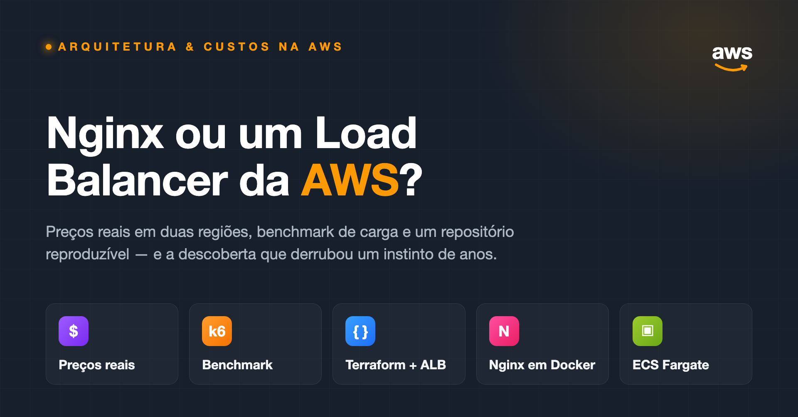

<div align="center">



[](https://builder.aws.com/content/3Gm9On5fdYoVnRUCDQ3JtXNwRsy/nginx-ou-load-balancer-da-aws-o-que-aprendi-entregando-15-sistemas-em-software-house)

[](terraform-alb/)
[](nginx-docker/)
[](benchmark/)
[](terraform-alb/)

**Repositório prático do artigo — todos os números podem ser reproduzidos a partir deste código.**

</div>

> ### 💡 A descoberta
> Com pouco tráfego, o ALB gerenciado custa **$17.23/mês** — contra **$30.37/mês** de um par de EC2 t3.small rodando Nginx em alta disponibilidade. O instinto de que "Nginx é a opção barata" só sobrevive sem HA ou com tráfego pesado. **Essa conta é o assunto do artigo.**

---

## O que tem aqui

Três stacks executáveis e um harness de benchmark que tornam os trade-offs concretos:

```
alb-vs-nginx/
├── app/              # App de exemplo em Node.js — porta 3000, /health, responde com o hostname
├── nginx-docker/     # docker-compose: 2 réplicas da app atrás do nginx (config derivada de produção)
├── terraform-alb/    # VPC + ALB + ECS Fargate (2 tasks) — a alternativa gerenciada
└── benchmark/        # Teste de carga com k6 via Docker: direto vs através do nginx
```

A config do Nginx espelha um template real de produção de software house (blocos de TLS removidos para o demo local), estendida com o bloco `upstream` que você adiciona quando uma réplica só deixa de ser suficiente — exatamente o momento em que a conversa sobre o ALB começa.

## Início rápido

**1 — Load balancing com Nginx, local (menos de um minuto):**

```bash
cd nginx-docker
docker compose up -d --build
curl -s localhost:8080   # rode algumas vezes — veja o served_by alternar entre as réplicas
```

**2 — Meça o overhead do proxy (k6 via Docker, sem instalar nada):**

```bash
cd benchmark
./run.sh                 # dois cenários de 60s: direto vs através do nginx
```

**3 — A mesma app atrás de um ALB de verdade (opcional, precisa de conta AWS):**

```bash
cd terraform-alb
terraform init && terraform plan
# suba a imagem de app/ para o seu ECR antes — veja terraform-alb/README.md
```

> ⚠️ **Aviso de custo:** a stack Terraform custa ~$0.05/hora enquanto estiver no ar (us-east-1). **Rode `terraform destroy` quando terminar.**

## Resultados

**Benchmark** em rede Docker local — k6, 50 usuários virtuais, 60s, zero erros. Mede o overhead de proxy do Nginx, *não* a latência do ALB (metodologia completa no artigo):

| Cenário | req/s | p50 | p95 | p99 |
|---|---:|---:|---:|---:|
| Direto na app | 94,664 | 0.43 ms | 0.91 ms | 1.49 ms |
| Através do Nginx | 58,781 | 0.67 ms | 1.86 ms | 2.91 ms |

**Custo mensal** de setups equivalentes em alta disponibilidade — preços confirmados em 2026-07-20 via AWS Pricing API:

| Opção (us-east-1) | 100 GB/mês | 1 TB/mês | 5 TB/mês |
|---|---:|---:|---:|
| ALB (gerenciado) | **$17.23** | $24.43 | $56.42 |
| Nginx em 2x EC2 t3.small | $30.37 | $30.37 | $30.37 |
| Nginx em ECS Fargate, 2 tasks | $18.02 | $18.02 | $18.02 |

## Documentação por stack

| Stack | O que você encontra |
|---|---|
| [`nginx-docker/`](nginx-docker/README.md) | Quickstart do compose, walkthrough da config, teardown |
| [`terraform-alb/`](terraform-alb/README.md) | Push para o ECR, apply, custo estimado e o aviso de destroy |
| [`benchmark/`](benchmark/README.md) | Como rodar os dois cenários e onde caem os resultados |

## Requisitos

- **Docker** — para a stack do Nginx e o benchmark
- **Terraform ≥ 1.5** — opcional, só para a stack do ALB
- **Uma conta AWS** — só se você rodar `terraform apply`

---

<div align="center">

**Bernardo Kirsch**
Cloud Solutions Architect · AWS Student Builder Group Leader — Rio Grande do Sul, Brasil

[bekirsch.com](https://bekirsch.com) · [GitHub](https://github.com/kirschzao) · [LinkedIn](https://www.linkedin.com/in/bernardo-kirsch/)

</div>
